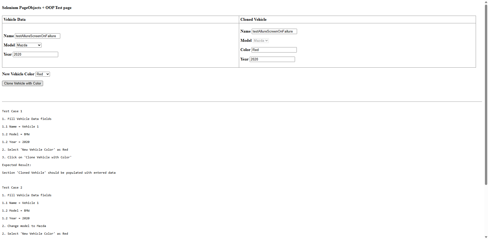

# Vehicle Cloning Test Automation

This project contains automated tests for the Vehicle Cloning functionality using WebdriverIO, Mocha, and Allure Reporter.

## 🚀 Features

- Automated UI tests for vehicle cloning functionality
- Page Object Model implementation
- Allure reporting integration
- ESLint and Prettier for code quality
- Screenshot capture on test failure
- Test retry mechanism for flaky tests

## 📋 Prerequisites

- Node.js (v14 or higher)
- npm (v6 or higher)
- Chrome browser

## 📝 Test Cases

### Test Case 1: Clone Vehicle with Initial Data
1. Fill Vehicle Data fields:
   - Name: Vehicle 1
   - Model: BMW
   - Year: 2020
2. Select 'New Vehicle Color' as Red
3. Click on 'Clone Vehicle with Color'
Expected Result:
Section 'Cloned Vehicle' should be populated with entered data 

### Test Case 2: Clone Vehicle with Changed Model
1. Fill Vehicle Data fields
   - Name: Vehicle 1
   - Model: BMW
   - Year: 2020
2. Change model to Mazda
2. Select 'New Vehicle Color' as Red
3. Click on 'Clone Vehicle with Color'
Expected Result:
Section 'Cloned Vehicle' should be populated with entered data 

## 🛠️ Project Structure

```
├── specs/                # Test specifications
│   └── vehicle.test.js   # Test cases
├── pageobjects/          # Page Object classes
│   └── VehiclePage.js    # Vehicle page object
├── wdio.conf.js          # WebdriverIO configuration
├── .eslintrc.js          # ESLint configuration
├── .prettierrc           # Prettier configuration
└── package.json          # Project dependencies
```

## 📊 Reports

Test reports are generated using Allure Reporter. After running tests, you can generate and view the report using:
```bash
npm run report
```

## 📷 Example Allure Report

